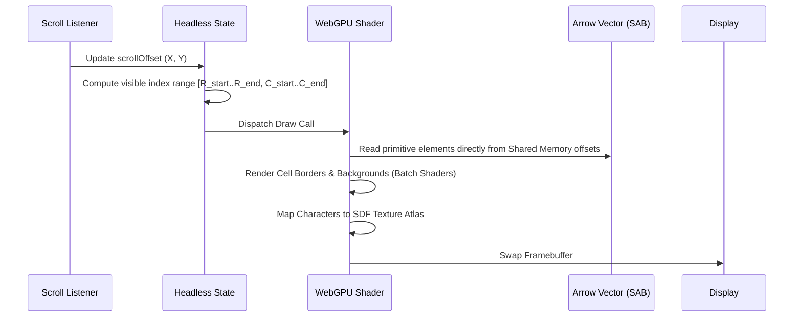

# Implementation Plan: Zen-Tabo Core Architecture

`zen-tabo` is an ultra-high-performance database-spreadsheet hybrid designed to scale past 1,000,000+ rows. By rejecting legacy Excel bloat (VBA, implicit type-casting, sparse-cell pointer arrays), the system achieves sub-millisecond vectorized calculations and 60+ FPS rendering under load.

---

## 1. System Architecture & Component Boundaries

The system maintains strict thread separation to ensure that heavy data parsing, SQL evaluations, and formula updates never block the UI thread.

```mermaid
graph TD
    subgraph UI Thread (Main)
        A[SolidJS UI Shell] <-->|Signals| B[Headless UI State Manager]
        B <-->|Render Coordinates| C[WebGPU Grid Renderer]
        C <-->|Canvas Context| D[(Display Viewport)]
    end

    subgraph Web Worker Pool
        E[Worker Orchestrator] <-->|Yjs Sync| F[CRDT Sync Worker]
        E <-->|Arrow IPC / SharedArrayBuffer| G[DuckDB WASM Core]
        G <-->|Vector Math| H[Formula Compiler WASM]
    end

    UI Thread <-->|SharedArrayBuffer IPC| Web Worker Pool
    Web Worker Pool <-->|Native FS Handles| I[(OPFS Storage / .ztb)]
```

### Component Details

| Module | Core Responsibility | Tech Stack | Communication |
| :--- | :--- | :--- | :--- |
| **SolidJS UI Shell** | Toolbar, sidebars, console sheets, conditional formatting controllers, SQL prompt panels. | SolidJS, CSS Variables, Outfit Font | Fine-grained reactive signals |
| **Headless UI State** | Active scroll position, selection bounding boxes, panel layout state, cursor coordinate. | TS Proxy, atomic primitives | Direct UI Main loop |
| **WebGPU Grid Renderer** | Virtualized drawing of grid lines, cells, highlights, and SDF text. | WebGPU, WGSL Shaders (Fallback: Canvas 2D) | Direct buffer mapping |
| **CRDT Sync Worker** | Conflict-free real-time edits tracking, client-to-client operations broadcast. | Yjs, WebSockets / WebRTC | Local delta logs |
| **DuckDB Core Worker** | Execution of SQL analytical queries, table mutations, schemas. | DuckDB-WASM, Apache Arrow | SharedArrayBuffer IPC |
| **Formula Compiler** | Compiling formula equations into vector loops targeting SIMD. | Rust, WASM Bindgen | Direct memory pointer mapping |

---

## 2. Memory & Data Layer Layout (Layered Columnar Vectorization)

Unlike legacy spreadsheets that associate cell instances with individual styling, values, and calculations, Zen-Tabo structures data in columnar formats while supporting localized cell overrides via a virtual override layering system.

```
[ BASE ARRAY COLUMN ]              [ ROW OVERRIDE BITMAP ]       [ SPARSE CELL OVERRIDES ]
(Type: Float64, Contiguous Memory)           (Roaring Bitmap)             (B-Tree / Block-Indexed)
Idx:      Memory Vector:                   Idx:   IsOverridden:           Idx:    Override Payload:
┌───────┬────────────────────────┐          ┌───────┬────────────┐         ┌───────┬─────────────────────────┐
│   0   │         100.50         │          │   0   │     0      │         │   1   │ Formula: "=SUM(B2:D2)"  │
├───────┼────────────────────────┤          ├───────┼────────────┤         ├───────┼─────────────────────────┤
│   1   │   [Masked Invalid]     │ ◄────────┼─  1   │     1      │ ──────► │   3   │ Raw String: "Exempt"    │
├───────┼────────────────────────┤          ├───────┼────────────┤         └───────┴─────────────────────────┘
│   2   │         350.00         │          │   2   │     0      │
├───────┼────────────────────────┤          ├───────┼────────────┤
│   3   │   [Masked Invalid]     │ ◄────────┼─  3   │     1      │
└───────┴────────────────────────┘          └───────┴────────────┘
```

### Memory Map & Override Specifications

* **SharedArrayBuffer Structure:**
  The core data blocks reside inside a shared memory buffer (SAB) partitioned into distinct regions:
  1. **Control Header Block** (32KB): Holds viewport indicators, active writing offsets, synchronization version flags, and thread locks.
  2. **Column Metadata Schema** (128KB): Declares column names, data type markers, column formulas, and byte array indexes.
  3. **Data Grid Block** (Variable MBs): Holds raw, contiguous columnar arrays formatted as Apache Arrow RecordBatches.
  4. **Dynamic String Heap** (Variable MBs): Implements category dictionary indexes to avoid repeating string constants.

* **Row Override Bitmaps (`RoaringBitmap`):**
  Each column maintains a highly efficient WebAssembly-backed Roaring Bitmap index.
  * If the bit at a row index is `0`, the engine reads directly from the homogeneous Base Apache Arrow Column at CPU speeds.
  * If the bit is `1`, the engine intercepts the read and fetches the override payload from the Sparse Override Store.

* **Sparse Override Store (Rust Memory Core):**
  Manages manual overrides (cell-specific formulas, static strings in numeric columns, values overriding formulas) in contiguous arrays in WASM memory:
  ```rust
  pub enum OverridePayload {
      LocalFormula(String),    // Cell-specific override formula AST
      StaticString(String),    // Heterogeneous text overrides
      PrimitiveFloat(f64),     // Override numeric constants
  }

  pub struct ColumnOverrideStore {
      pub override_mask: RoaringBitmap,
      pub row_indices: Vec<u32>,
      pub payloads: Vec<OverridePayload>,
  }
  ```


---

## 3. High-Performance Render Loop (WebGPU & Canvas)

The grid utilizes a custom-built virtualized viewport. The DOM is never modified during scrolling.



### Signed Distance Field (SDF) Font Atlas

To ensure sharp text zoom states and avoid costly CPU layout operations:
1. Standard font glyphs (numbers, basic alphanumeric symbols, currency glyphs) are baked into a high-DPI texture atlas.
2. WebGPU fragment shaders draw glyphs by sampling the distance maps in the shader.
3. Sub-pixel anti-aliasing is executed inside the GPU pipeline, resolving layout lag on high-DPI screens.

---

## 4. Formula Compiler & Vector Reactive Graph

Formulas are executed over entire column vectors instead of individual cell arrays.

```
Formula: Column("Total") = Column("Price") * Column("Tax")
```

### Compilation Pipeline

```
Formula string (=A * B)
   │
   ▼
Chevrotain AST Parser
   │
   ▼
Intermediate Representation (IR)
   │
   ▼
Rust Compiler Core (WASM Engine)
   │
   ▼
Vectorized Loop (SIMD Assembly)
```

### Dependency Resolution (DAG Engine)

1. Updates to Column data flag the respective column vertex in the Directed Acyclic Graph as **Dirty**.
2. A topological sort determines downstream dependency evaluation orders.
3. Calculations are vectorized using WASM SIMD, processing array segments concurrently inside the calculation worker thread.

---

## 5. Collaboration, Persistence & the `.ztb` Format

Zen-Tabo introduces the `.ztb` (Zen-Tabo Binary Container) structure for rapid document opening and robust persistence, using optimized CRDT representations and double-buffered background compaction.

### A. Yjs Document Sharding: Block-Group Delta Arrays

To prevent Yjs memory footprint inflation (which can exceed 2 GB for a million cells), Zen-Tabo rejects cell-level object instantiations. Instead, it shards the spreadsheet into **Pure Array Column Shards** partitioned by row-group blocks (e.g., 100,000 rows per block).

```
Master Y.Doc (Top-Level Y.Map)
├── "metadata" ──> Y.Map (Schema definitions, styles, panel views)
└── "data_shards" ──> Y.Map
    ├── "col_001_block_0" ──> Y.Array<CRDTOp> (Rows 0 - 99,999)
    ├── "col_001_block_1" ──> Y.Array<CRDTOp> (Rows 100,000 - 199,999)
    └── "col_002_block_0" ──> Y.Array<CRDTOp>
```

#### The `CRDTOp` Binary Schema
Each entry inside a block-level `Y.Array` is a compact immutable transaction record:
```typescript
type CRDTOp = {
  r: number;          // Relative Row Index Offset inside the block
  t: number;          // Operation Type: 0 = SetRawValue, 1 = SetFormula, 2 = Delete
  v: string | number; // Primitive value or formula string payload
};
```
* **Run-Length Compression:** By storing updates as sequential operations inside a column-block `Y.Array`, Yjs compresses structural metadata items into contiguous runs, shrinking memory use by over 90% (<35 MB for 1,000,000 cells).
* **Lazy Shard Ingestion:** Shards are initialized lazily. If a cell on row 550,000 is modified, only the sub-tree block representing rows 500,000 to 600,000 is instantiated in memory.

### B. Incremental OPFS Write-Ahead Logging

To guarantee offline-first safety, mutations serialize to raw binary update blocks via `Y.encodeStateAsUpdate(ydoc)` and stream immediately to a Write-Ahead Log (WAL) file `delta_log.arrow` on the browser's **Origin Private File System (OPFS)**.

```
[Local Collaborative Worker Updates]
                │
                ▼ (Yjs Binary State Vector Delta Chunks)
[Direct Shared Buffer / Worker Access Channel]
                │
                ▼ OPFS FileSystemSyncAccessHandle.write()
[delta_log.arrow (Immediate Storage WAL)]
```

#### Code Blueprint: `opfs-storage.worker.ts`
```typescript
let accessHandle: FileSystemSyncAccessHandle | null = null;

self.onmessage = async (event: MessageEvent) => {
  const { type, payload } = event.data;

  if (type === 'INIT_STORAGE') {
    const root = await navigator.storage.getDirectory();
    const fileHandle = await root.getFileHandle('delta_log.arrow', { create: true });
    accessHandle = await fileHandle.createSyncAccessHandle();
  }

  if (type === 'APPEND_TRANSACTION_DELTA') {
    if (!accessHandle) return;
    const binaryDeltaBuffer: Uint8Array = payload.binaryDelta;
    
    // Write size prefix
    const sizeBuffer = new Uint8Array(4);
    new DataView(sizeBuffer.buffer).setUint32(0, binaryDeltaBuffer.byteLength, true);
    
    accessHandle.write(sizeBuffer);
    accessHandle.write(binaryDeltaBuffer);
    self.postMessage({ type: 'DELTA_PERSISTED', timestamp: payload.timestamp });
  }
};
```

### C. Background Compaction (Double-Buffering Isolation Protocol)

To prevent analytical query degradation over bloated log arrays, a background compaction worker collapses the WAL (`delta_log.arrow`) into the primary Parquet data assets (`table_0_core.parquet`) using a double-buffering pointer swap.

```
[ ACTIVE COLLABORATIVE STATE ]
            │                      │
            ▼                      ▼
┌──────────────────┐   ┌───────────────────────┐
│ DuckDB / WASM    │   │ Yjs Collaborative     │
│ Runtime Engine   │   │ Tracking Engine       │
└────────┬─────────┘   └──────────┬────────────┘
         │                        │
         │                        ▼ Writes continue uninterrupted
         │               ┌─────────────────────────────────┐
         │               │ WAL Log Active:                 │
         │               │ delta_log_gen2.arrow (NEW)      │
         │               └─────────────────────────────────┘
         ▼ Reads Source Material
┌─────────────────────────────────┐
│ WAL Log Frozen:                 │
│ delta_log_gen1.arrow (OLD)      │
└────────────────┬────────────────┘
                 │
                 ▼ (Merged in Analytical Compaction Worker)
┌─────────────────────────────────┐
│ Base Immutable Matrix File:     │
│ table_0_core.parquet            │
└────────────────┬────────────────┘
                 │
                 ▼ Generates Consolidated Output Asset
┌─────────────────────────────────┐
│ table_1_core.parquet            │
└─────────────────────────────────┘
```

1. **Generation Log Roll:** The Collaborative Sync Worker renames the active `delta_log.arrow` to a frozen snapshot segment `delta_log_gen1.arrow`, constructing an empty `delta_log_gen2.arrow` to capture incoming user inputs in parallel.
2. **Background Vector Consolidation:** An isolated Analytical Compaction Worker spawns a background DuckDB-WASM query to merge the base Parquet file with the frozen delta log:
   ```sql
   COPY (
     SELECT
       COALESCE(d.row_id, b.row_id) AS row_id,
       COALESCE(d.column_value, b.column_value) AS column_value
     FROM read_parquet('table_0_core.parquet') b
     FULL OUTER JOIN read_arrow_ipc('delta_log_gen1.arrow') d
     ON b.row_id = d.row_id
   ) TO 'table_1_core.parquet' (FORMAT 'PARQUET', COMPRESSION 'ZSTD');
   ```
3. **Atomic Pointer swap:** On query completion, the active runtime swaps query pointers to `table_1_core.parquet` in a single tick. The old Parquet and frozen delta files are deleted.
4. **CRDT Garbage Collection:** The Yjs document runs a compaction pass (`Y.encodeStateAsUpdate()`), garbage collecting old editing history and deletion markers.

### Project Storage Layout (`.ztb` Directory Container)
```
my_spreadsheet.ztb/
├── metadata.json           # Schema definitions, column types, styles, UI views
├── data/
│   ├── table_0_core.parquet # Compressed base column data
│   └── delta_log.arrow     # Active uncompressed Arrow IPC edit vector log
└── sync/
    └── crdt_history.bin    # Consolidated binary history log (Yjs update stream)
```


---

## 6. Advanced Analytics & Side-Dock Integration

To calculate statistical profiles and execute text regex patterns across millions of rows at machine speed, Zen-Tabo implements specialized WASM-compiled pipelines that process column arrays contiguously.

### A. Vectorized Column Statistics (Single-Pass Welford's Accumulator)

Rather than running multiple loops to compute Mean, Variance, and Standard Deviation, the Rust core utilizes **Welford's Algorithm for Online Variance** and **pdqselect** for median checks. This computes all key metrics in a single cache-friendly memory pass.

```rust
#[wasm_bindgen]
pub struct ColumnStats {
    pub mean: f64,
    pub median: f64,
    pub variance: f64,
    pub std_dev: f64,
    pub min: f64,
    pub max: f64,
    pub histogram: Vec<u32>,
}

#[wasm_bindgen]
pub fn compute_column_analytics(
    arrow_array_ptr: *const u8,
    array_len: usize,
    min_hint: f64,
    max_hint: f64
) -> ColumnStats {
    let raw_slice = unsafe { std::slice::from_raw_parts(arrow_array_ptr as *const f64, array_len) };
    let mut count = 0;
    let mut mean = 0.0;
    let mut m2 = 0.0;
    let mut min_val = f64::INFINITY;
    let mut max_val = f64::NEG_INFINITY;
    let mut histogram = vec![0u32; 10];
    let bin_width = (max_hint - min_hint) / 10.0;

    for &val in raw_slice.iter() {
        if val.is_nan() { continue; }
        count += 1;

        // Welford's calculation
        let delta = val - mean;
        mean += delta / count as f64;
        let delta2 = val - mean;
        m2 += delta * delta2;

        // Min/Max bounds checking
        if val < min_val { min_val = val; }
        if val > max_val { max_val = val; }

        // O(1) Histogram Binning
        if val >= min_hint && val <= max_hint && bin_width > 0.0 {
            let mut bin_idx = ((val - min_hint) / bin_width).floor() as usize;
            if bin_idx >= 10 { bin_idx = 9; }
            histogram[bin_idx] += 1;
        }
    }

    // pdqselect isolates median in O(N) instead of O(N log N) sorting
    let mut mutable_data = raw_slice.to_vec();
    mutable_data.retain(|&v| !v.is_nan());
    let mid = mutable_data.len() / 2;
    mutable_data.select_nth_unstable(mid);
    let median = mutable_data[mid];

    ColumnStats {
        mean,
        median,
        variance: m2 / (count - 1) as f64,
        std_dev: (m2 / (count - 1) as f64).sqrt(),
        min: min_val,
        max: max_val,
        histogram,
    }
}
```

### B. Memory-Optimized Regex Pipeline

String transformations over millions of cells traditionally cause severe garbage collector thrashing. Zen-Tabo implements two allocation-free pipelines based on column schema type:

1. **General Text Column (`StringArray`):** Matches are written directly to a continuous pre-allocated **Arrow StringBuilder** byte stream instead of allocating heap memory per row.
2. **Low-Cardinality Column (`DictionaryArray`):** The regex engine is run *only* across distinct dictionary-encoded values, copying matching key indices across rows to reduce CPU load.

```rust
#[wasm_bindgen]
impl RegexEngine {
    // Vectorized extraction straight to Arrow StringBuilder
    pub fn vectorized_extract(&self, array: &StringArray) -> StringArray {
        let mut builder = StringBuilder::with_capacity(array.len(), array.value_data_len());
        for i in 0..array.len() {
            if array.is_null(i) {
                builder.append_null();
                continue;
            }
            if let Some(captures) = self.compiled_regex.captures(array.value(i)) {
                let match_str = captures.get(1).map_or_else(|| captures.get(0).unwrap().as_str(), |m| m.as_str());
                builder.append_value(match_str);
            } else {
                builder.append_null();
            }
        }
        builder.finish()
    }
}
```

### C. Side-Docked SQL Editor Console

A side-docked SQL prompt panel uses DuckDB-WASM execution targets to query sheet memory directly without serialization delay.

```sql
SELECT Region, SUM(Revenue) 
FROM ActiveSheet 
WHERE Revenue > 10000 
GROUP BY Region;
```
Calculations run inside the background SQL thread, projecting result sets straight out to WebGPU viewport panels as a dynamic, readable view.


---

## 7. Aesthetics, Styling & Premium UI Specification

The UI features a high-end dark-mode look, prioritizing clean layout structures and fluid animations.

```css
:root {
  /* HSL Color System */
  --bg-primary: hsl(220, 15%, 8%);
  --bg-secondary: hsl(220, 15%, 12%);
  --bg-surface: hsl(220, 15%, 16%);
  
  --border-color: hsl(220, 10%, 20%);
  --border-glow: hsl(220, 80%, 60%);
  
  --text-primary: hsl(0, 0%, 95%);
  --text-secondary: hsl(220, 10%, 70%);
  --text-accent: hsl(150, 60%, 55%); /* Emerald green accent */

  /* Glassmorphism settings */
  --glass-bg: rgba(15, 17, 23, 0.7);
  --glass-border: rgba(255, 255, 255, 0.08);
  --glass-blur: blur(12px);

  /* Typography */
  --font-family: 'Outfit', sans-serif;
  --font-mono: 'JetBrains Mono', monospace;
}
```

### UI Interaction Rules

* **Glassmorphism Panels:** Sidebar docks, toolbar lists, and popup dialogs overlay with `--glass-bg`, `--glass-border`, and `--glass-blur`.
* **Micro-Animations:** Selection cells expand slightly on double click; column header stats transition with a `transform 150ms cubic-bezier(0.4, 0, 0.2, 1)`.
* **Visual Status Indicators:** Synced network peers display as subtle glowing dots with breathing opacity transitions.

---

## 8. Directory & File Structure Blueprint

```
zen-tabo/
├── index.html                 # Main SPA HTML container
├── package.json               # Package configurations & dependencies
├── tsconfig.json              # TypeScript engine compiler rules
├── src/
│   ├── main.tsx               # SolidJS initialization & UI mounts
│   ├── index.css              # Global tokens, resets, & utility frameworks
│   ├── components/            # SolidJS UI Shell elements
│   │   ├── Toolbar.tsx        # Action toolbar & document status
│   │   ├── Sidebar.tsx        # Statistical metrics & SQL console
│   │   ├── FormulaBar.tsx     # Vectorized formula editor interface
│   │   └── Viewport.tsx       # Grid Canvas container
│   ├── core/                  # Web Worker & computation logic
│   │   ├── worker-pool.ts     # Engine orchestrator
│   │   ├── db-engine.worker.ts# DuckDB & Arrow IPC execution thread
│   │   ├── sync.worker.ts     # Yjs sync, OPFS WAL, websocket pipelines
│   │   └── formula/           # Custom compiler
│   │       ├── parser.ts      # Formula string AST builder
│   │       └── compiler.ts    # Vector translation layer
│   ├── renderer/              # High-performance grid drawing
│   │   ├── canvas-fallback.ts # High-fidelity Canvas 2D engine
│   │   ├── webgpu-shader.wgsl # WGSL pipeline instancing layout
│   │   └── webgpu-grid.ts     # WebGPU surface scheduler
│   └── lib/                   # Internal helpers & types
│       ├── types.ts           # Schema models
│       └── arrow-utils.ts     # Binary byte helpers
└── Cargo.toml                 # Rust WASM Vector compilation dependencies
```

---

## 9. Phased Implementation Roadmap

### Phase 1: Core Layout & Thread Ingestion (Sprint 1-2)
* Setup SolidJS, TypeScript, and Worker configurations.
* Implement UI shell with global HSL design tokens.
* Build background worker pool initialized with DuckDB-WASM.
* Establish SharedArrayBuffer zero-copy structures.

### Phase 2: High-Performance Renderer Grid (Sprint 3-4)
* Develop virtual viewport rendering pipeline (Canvas 2D framework fallback).
* Optimize scroll mechanisms to handle virtual row offsets dynamically.
* Implement mouse selection overlays, column resizing, and keystroke listeners.
* Implement WebGPU shader prototype and SDF character rendering.

### Phase 3: Formula Compiler & Vector DAG (Sprint 5-6)
* Setup Chevrotain parser translating formula strings to Abstract Syntax Trees.
* Build DAG dependency manager mapping dependencies down to column-group vertices.
* Implement Rust-based compilation engine translating formulas to JS/WASM loops.
* Integrate regex functions (`REGEXEXTRACT`, `REGEXREPLACE`) and modern arrays (`UNIQUE`, `FILTER`).

### Phase 4: Collaborative Sync & OPFS WAL (Sprint 7-8)
* Build Yjs CRDT synchronization worker managing local delta journals.
* Wire WebSocket synchronization streams for parallel network sessions.
* Create write-ahead logging (WAL) saving delta operations to browser OPFS.
* Code compiler routines converting WAL chunks into compressed Parquet core files.

### Phase 5: Stats Panels & SQL Side-Dock (Sprint 9-10)
* Construct automatic background summarization queries for selected columns.
* Connect column distribution charts, mean, median, min, max parameters.
* Design the side-docked code editor supporting direct SQL and JS scripts.
* Enable script mutations writing outputs back into active sheet vectors.

### Phase 6: Polish, Interop & Verification (Sprint 11-12)
* Implement `.ztb` file export/import pipelines.
* Complete performance validation suites (1,000,000-row scroll benchmarks).
* Polish animations, conditional styling interfaces, dark modes, and layout aesthetics.

---

## 10. Verification & Quality Matrix

| Step | Scope | Target Metrics | Verification Command |
| :---: | :--- | :--- | :--- |
| **1** | System Integrity | Zero TypeScript compilation errors. | `npm run typecheck` |
| **2** | Performance | Scroll performance remains at stable 60 FPS with 1,000,000 rows. | Lighthouse Profiler / Custom telemetry logs |
| **3** | Formula Speed | Column math executed over 1,000,000 rows completes in < 15ms. | Native Benchmark suites |
| **4** | Sync Integrity | Zero conflict divergences under parallel user mock edits. | Yjs conflict validation suites |
| **5** | Disk Persistence | Zero data loss on artificial page crash mid-edit. | OPFS WAL recovery integration test |
